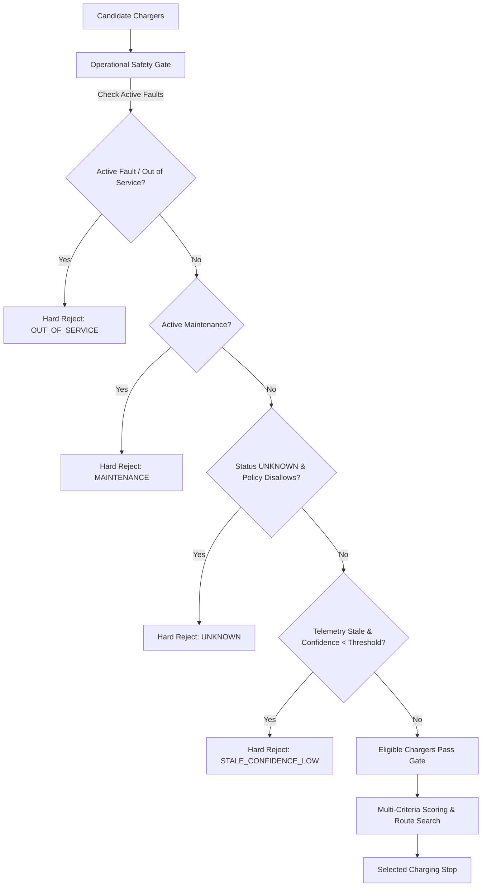

# VoltGuide Charger Operational Safety, Trust, and Availability Layer (Change 27)

## Executive Summary
This document establishes the architecture, data audit, and operational safety contracts for the **VoltGuide Charger Operational Safety, Trust, and Availability Layer** (Change 27).

### Core Product Principle
> **A charger must pass an OPERATIONAL ELIGIBILITY gate before it can participate in recommendations or journey planning.**

**Reliability is NOT the same thing as operational availability.**
- **Reliability**: *"How trustworthy and successful has this charger historically been across past sessions?"*
- **Operational Status**: *"Can this charger currently be recommended for this journey right now?"*

Under no circumstances may high historical reliability (e.g., 0.99), low charging cost, short route diversion, or ultra-fast power output override an operational failure. A highly reliable charger that is currently out of service **MUST be hard-rejected**.

---

## 1. Current Charger-Status Data Audit

### Authoritative Database Schema & Processed Feature Sets
We audited the existing schema (`database/schema.sql`, `database/models.py`) and processed feature matrices (`charger_reliability_features.csv`, `charger_occupancy_features.csv`):

| Schema / Dataset Field | Native Table / Source | Classification | Operational Meaning |
| :--- | :--- | :--- | :--- |
| `id`, `name`, `operator`, `latitude`, `longitude` | `chargers` | Static Specs | Station identity and physical geographic coordinate. |
| `charging_power_kw`, `num_ports`, `connector_type` | `chargers` | Static Specs | Maximum physical hardware capability. |
| `updated_at` | `chargers` | Metadata Timestamp | Last database record modification timestamp. |
| `status` ('success', 'failed', 'interrupted') | `charging_sessions` | Historical Record | Past charging session outcomes (simulated or real). |
| `rating`, `review_text`, `sentiment_score` | `reviews` | Historical Sentiment | Driver feedback and NLP sentiment scoring. |
| `reported_at`, `fault_type`, `resolved`, `resolved_at` | `faults` | Incident Telemetry | Unresolved records (`resolved = False`) represent active hardware outages. |
| `maintenance_date`, `description`, `technician` | `maintenance_logs` | Service Telemetry | Past and active scheduled/unscheduled service downtime. |
| `success_rate`, `failure_rate`, `interrupted_rate` | `charger_reliability_features.csv` | Historical Aggregate | Target and features for the LOOCV Random Forest/XGBoost reliability predictor. |
| `days_since_last_fault`, `resolved_fault_ratio` | `charger_reliability_features.csv` | Historical Aggregate | Historic fault frequency and maintenance responsiveness. |
| `probability_available` / `utilization_rate` | `charger_occupancy_features.csv` | Temporal Forecast | Statistical time-of-day occupancy / port availability probability (NOT hardware status). |

### Historical vs. Current/Live Distinction
- **Historical Data**:
  Session success ratios, past completed faults, completed maintenance logs, historic star ratings, and statistical time-of-day occupancy models reflect past performance patterns over days, weeks, and months.
- **Current / Operational Data**:
  In the current architecture, there is **no direct real-time hardware telemetry feed** from physical charging stations. Operational eligibility is evaluated from:
  1. Active unresolved faults (`resolved = False`) in `faults`.
  2. Active ongoing maintenance in `maintenance_logs`.
  3. Crowd-sourced user feedback submitted via the new feedback system (`POST /chargers/{id}/feedback`).
  4. Explicit provider telemetry when connected.

### Data Honesty Disclosure
VoltGuide will **never claim** that it knows a charger is operational "right now" unless an authoritative real-time provider supplies verified live data.
Until live telemetry hardware is deployed, all station availability is transparently labeled as:
> *"Operational confidence based on latest available data"*

---

## 2. Operational Status Model

VoltGuide defines 5 normalized operational states (`OperationalStatus`):

```
+-----------------------------------------------------------------------------------+
| OperationalStatus | Semantic Definition                        | Default Gate     |
+===================+============================================+==================+
| AVAILABLE         | Charger operating normally; eligible for  | ELIGIBLE         |
|                   | recommendation and journey planning        |                  |
+-------------------+--------------------------------------------+------------------+
| DEGRADED          | Partial port failure or reduced power;    | REJECT           |
|                   | eligible ONLY under explicit policy        | (Configurable)   |
+-------------------+--------------------------------------------+------------------+
| OUT_OF_SERVICE    | Offline, confirmed failure, active fault,  | HARD REJECT      |
|                   | or repeated negative crowd reports         |                  |
+-------------------+--------------------------------------------+------------------+
| MAINTENANCE       | Scheduled or unscheduled service in        | HARD REJECT      |
|                   | progress                                   |                  |
+-------------------+--------------------------------------------+------------------+
| UNKNOWN           | Insufficient or unverified data; never     | REJECT           |
|                   | silently treated as definitely operational | (Configurable)   |
+-----------------------------------------------------------------------------------+
```

### Configurable Operational Policy (`OperationalPolicy`)
Policies can be tuned per fleet or driver profile:
- `allow_degraded: bool` (default: `False`): When False, degraded chargers are rejected; when True, allowed with warning annotation.
- `allow_unknown: bool` (default: `False`): When False, stations with unverified status are rejected; when True, requires minimum trust threshold.
- `max_stale_hours: float` (default: `48.0`): Maximum age of status data before confidence penalty applies.
- `stale_confidence_penalty: float` (default: `0.50`): Multiplier applied to confidence when data exceeds freshness threshold.
- `consecutive_negative_threshold: int` (default: `3`): Number of recent negative reports triggering temporary exclusion.
- `negative_feedback_window_hours: float` (default: `24.0`): Rolling time window for counting crowd reports.
- `min_confidence_threshold: float` (default: `0.40`): Minimum confidence required for eligibility.

---

## 3. Hard Operational Eligibility Gate

The Operational Safety Gate executes **strictly before** candidate scoring and route calculation:



### Absolute Invariant
High reliability, low tariff, fast charging, or short detour distances **cannot** override an operational rejection.

---

## 4. Freshness Handling & Confidence Decay

When operational status timestamps are available (`status_last_updated`, `updated_at`, `reported_at`):
1. **Fresh Telemetry** (`status_age_hours <= max_stale_hours`):
   $$\text{status\_confidence} = \max\left(0.85, 1.0 - \frac{\text{age}}{\text{max\_stale\_hours}} \times 0.15\right)$$
2. **Stale Telemetry** (`status_age_hours > max_stale_hours`):
   $$\text{status\_confidence} = \max\left(0.10, 0.85 \times \frac{\text{max\_stale\_hours}}{\text{age}} \times \text{stale\_confidence\_penalty}\right)$$
3. **Missing Telemetry**:
   - For `UNKNOWN` status: confidence defaults to `0.30`.
   - For historical dataset baseline with complete records: confidence defaults to `0.85`.

If status confidence falls below `min_confidence_threshold` (0.40), the station is marked ineligible due to stale data.

---

## 5. User Feedback System

Drivers or automated telemetry submit charging attempt outcomes:
- `SUCCESSFUL_CHARGE`
- `STATION_UNAVAILABLE`
- `CHARGER_FAULT`
- `CONNECTOR_PROBLEM`
- `OTHER`

### Aggregation & Crowd Moderation Rules
- **No Single-Point-of-Failure**: A single user report is never treated as permanent ground truth.
- **Single Negative Report**: Reduces `status_confidence` and flags warnings, but does not trigger immediate shutdown.
- **Repeated Negative Reports**: Receiving $\ge 3$ negative reports within a 24-hour window automatically transitions the charger status to `OUT_OF_SERVICE` and excludes it from recommendation.
- **Positive Reports**: Successful sessions increment positive feedback counts and contribute to trust recovery.

---

## 6. Station Trust Score & Existing Reliability Model Re-Use

VoltGuide does **not** create a conflicting second reliability system. Instead, it maintains strict separation between:
1. **Historical Reliability** ($R_{\text{hist}} \in [0.0, 1.0]$):
   Predictive model (Random Forest / XGBoost LOOCV) trained on historical sessions, durations, and ratings.
2. **Operational Eligibility** ($\text{eligible} \in \{\text{True}, \text{False}\}$):
   Boolean safety gate based on current status, active faults, and freshness.
3. **Composite Station Trust Score** ($T \in [0.0, 1.0]$):
   Combines historical reliability, fault resolution ratio, data freshness, and crowd feedback:
   $$T = \left(R_{\text{hist}} \times \text{fault\_ratio} \times 0.70\right) + \left(\text{confidence} \times 0.30\right) + \Delta_{\text{feedback}}$$
   *(discounted by $25\%$ if status is `DEGRADED`)*.

---

## 7. Conflicting Signals Handling

| Scenario | Historical Reliability | Current Status / Evidence | Result | Rationale |
| :--- | :--- | :--- | :--- | :--- |
| **A** | $0.98$ | `OUT_OF_SERVICE` (active fault) | **REJECT** | Operational safety gate takes precedence over historical success. |
| **B** | $0.99$ | `MAINTENANCE` | **REJECT** | Station physically undergoing maintenance cannot charge vehicles. |
| **C** | $0.65$ | `AVAILABLE` | **ELIGIBLE** | Station is functional, but lower reliability penalizes utility rank score. |
| **D** | $0.90$ | `UNKNOWN` (no recent verification) | **REJECT** | Never silently classify UNKNOWN as AVAILABLE under default policy. |
| **E** | $0.95$ | $3$ consecutive negative reports | **REJECT** | Crowd signal temporarily excludes station until resolved. |

---

## 8. API Compatibility & Schema Additions

The recommendation and planning endpoints extend their payloads while remaining $100\%$ backward-compatible:

```json
{
  "charger_id": 1,
  "name": "Mandya Express DC Supercharger",
  "operational_status": "AVAILABLE",
  "status_confidence": 0.95,
  "status_last_updated": "2026-09-22T14:30:00+00:00",
  "reliability": 0.98,
  "availability": 0.90,
  "probability_available": 0.90,
  "eligible_for_planning": true,
  "rejection_reason": null,
  "trust_score": 0.971
}
```

### New Endpoints
1. `POST /chargers/{charger_id}/feedback`:
   Record crowd or session charging feedback.
2. `GET /chargers/{charger_id}/operational-status`:
   Retrieve current operational status, trust score, and crowd summary.

---

## 9. Provider Abstractions (Hardware & Real-Time API Boundary)

To prepare for future integrations without writing network or hardware calls today:
- `OperationalStatusProvider` (Abstract base): Defines interface `get_status(charger_id, charger_data, policy, as_of)`.
- `HistoricalDatabaseStatusProvider`: Standard implementation evaluating database faults, maintenance, sessions, and feedback.
- `SimulatedLiveStatusProvider`: Allows mock live telemetry injection (e.g., simulating ESP32 state changes) for automated testing.
- `HardwareState` enum: (`AVAILABLE`, `CHARGING`, `FAULTED`, `UNAVAILABLE`, `MAINTENANCE`) mapped to normalized `OperationalStatus`.

---

## 10. Scope Boundaries: What Was NOT Implemented
In strict compliance with Change 27 instructions:
- **NO multi-stop journey planning** (800 km routes, multi-stop insertion).
- **NO external Google Places / Google Routes API integration**.
- **NO physical ESP32 / OCPP / MQTT connections**.
- **NO frontend redesign**.
